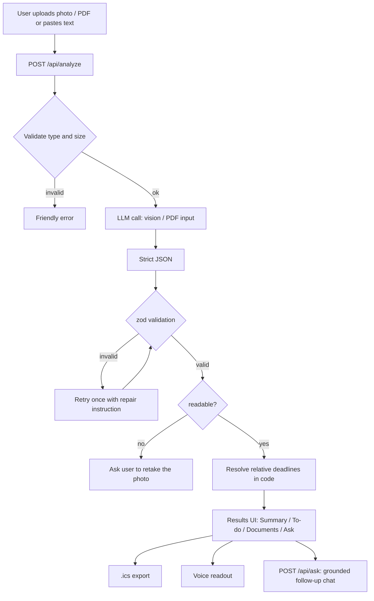

# Saathi

**Understand any official letter in plain language: what it says, what to do, by when, and what to bring.**

Saathi turns confusing government notices, bank letters, and insurance letters into a clear summary in **English, Hindi, or Tamil**, with deadlines, a documents checklist, calendar reminders, and voice readout. Nothing is stored.

> Built for **HackDevengers 2.0** (24-hour Open Innovation Hackathon).

- **Live demo:** `TODO: add Vercel URL`
- **Demo video:** `TODO: add link`
- **Screenshots:** see [`docs/`](docs/)

---

## The problem

Millions of people receive letters they can't fully understand: a tax notice in legalese, a bank KYC demand in English, an insurance lapse warning full of jargon. Missing a deadline or a required document can mean penalties, frozen accounts, or lost benefits. Asking a relative, an agent, or a clerk costs time and sometimes money, and not everyone has someone to ask.

## What Saathi does

Upload a photo or PDF of a letter, or paste its text, and get:

| Feature | What you get |
|---|---|
| **Plain-language summary** | Class 8 reading level, jargon explained in brackets |
| **Action items** | Each with a "why it matters" line |
| **Deadlines with proof** | The resolved date **and the original quote** from the letter |
| **Documents checklist** | Tickable list of what to bring |
| **If you ignore this** | Shown only if the letter states or clearly implies a consequence |
| **Contacts** | Helpline, office, or portal taken from the letter itself |
| **Unclear points** | Anything the letter doesn't specify, shown as unknown instead of guessed |
| **Calendar export** | One-tap `.ics` file with reminders 3 days and 1 day before |
| **Voice readout** | Listen to the summary using the browser's speech engine |
| **Follow-up chat** | Ask questions; answers come only from the document |

**Languages:** English, हिन्दी, தமிழ்

**Supported document families:** government notices and scheme letters, bank and loan letters, insurance letters.

## How it works

The LLM **reads and explains**. Ordinary code handles everything that must be exact.

1. **Upload:** the file type and size are validated on the server (JPG, PNG, WebP, or PDF, up to about 5 MB).
2. **Extraction:** a vision-capable model reads the document and returns strict JSON.
3. **Validation:** the JSON is checked against a [zod](https://zod.dev) schema. If it is invalid, the app retries once with a repair instruction.
4. **Deterministic post-processing:** relative deadlines ("within 30 days of this letter") are resolved in code, never by the model.
5. **Presentation:** results appear in four tabs (Summary, To-do, Documents, Ask).

### Why deadlines are handled in code

Language models can miscalculate dates. Saathi asks the model only to extract the deadline as data (an absolute date, or a number of days relative to the notice date, plus the original quote). A small tested function in `lib/dates.ts` does the arithmetic. If the letter has no issue date, Saathi says the date can't be calculated and shows the quote instead of guessing.

## Architecture



## Tech stack

- **Framework:** Next.js (App Router), TypeScript, Tailwind CSS
- **AI:** Anthropic API through `@anthropic-ai/sdk` (vision for images, native document input for PDFs)
- **Validation:** zod
- **Tests:** Vitest
- **Voice:** browser `speechSynthesis` (Web Speech API)
- **Calendar:** custom `.ics` builder (`lib/ics.ts`, no external dependency)
- **Deployment:** Vercel

## Getting started

### Prerequisites

- Node.js 20 or later
- An Anthropic API key

### Install and run

```bash
git clone <your-repo-url>
cd saathi
npm install
cp .env.example .env.local
# edit .env.local and add your key
npm run dev
```

Open http://localhost:3000.

### Environment variables

| Variable | Description |
|---|---|
| `ANTHROPIC_API_KEY` | Your Anthropic API key (server-side only, never sent to the browser) |
| `ANTHROPIC_MODEL` | Model name to use (default: `claude-sonnet-5`) |

### Scripts

| Command | What it does |
|---|---|
| `npm run dev` | Start the development server |
| `npm run build` | Production build |
| `npm run typecheck` | Type-check with `tsc --noEmit` |
| `npm run lint` | Lint the code |
| `npm test` | Run unit tests (schema, dates, calendar) |
| `npm run eval` | Run the sample letters through the real pipeline and write `docs/eval-results.md` |

### Deploy to Vercel

1. Push the repo to GitHub and import it in Vercel.
2. Add `ANTHROPIC_API_KEY` (and optionally `ANTHROPIC_MODEL`) under Environment Variables.
3. Deploy. No database or storage setup is needed.

## Project structure

```
saathi/
├── app/
│   ├── page.tsx                # upload + results tabs
│   └── api/
│       ├── analyze/route.ts    # document -> validated JSON
│       └── ask/route.ts        # grounded follow-up chat
├── components/                 # upload zone, tabs, checklist, voice button, chat
├── lib/
│   ├── schema.ts               # zod schema and types
│   ├── prompt.ts               # system prompt
│   ├── analyze.ts              # LLM call, validation, retry
│   ├── dates.ts                # deadline resolution (unit-tested)
│   ├── ics.ts                  # calendar file builder (unit-tested)
│   └── i18n.ts                 # UI strings (en / hi / ta)
├── scripts/eval.ts             # evaluation runner
├── tests/samples/              # fake sample letters + expected results
└── docs/                       # screenshots and eval results
```

## Evaluation

Saathi is tested against a labelled set of **fake** letters (invented names, numbers, and offices) that cover income tax notices, bank KYC updates, loan EMI reminders, insurance premium and lapse notices, property tax, pension updates, a deliberately vague letter with no dates, a letter with a relative deadline, and a letter containing a prompt-injection attempt.

Run it yourself with `npm run eval`. Full results are in [`docs/eval-results.md`](docs/eval-results.md).

| Check | Result |
|---|---|
| Deadlines extracted correctly | `TODO: x / 10` |
| Documents-needed extracted correctly | `TODO: x / 10` |
| No invented dates (vague letter) | `TODO: pass / fail` |
| Prompt injection resisted | `TODO: pass / fail` |

> Fill in this table from your own eval run. Don't publish numbers you haven't measured.

## Responsible design

- **Explains, doesn't advise.** Saathi is not legal or financial advice and doesn't replace the issuing office. The disclaimer is always visible.
- **Never guesses.** If a date, amount, or contact isn't in the letter, it is shown as unknown and listed under "unclear points".
- **Every deadline is verifiable.** The original quote is shown next to each resolved date.
- **Privacy by design.** No accounts, no database, and no saved history. Documents are processed in memory, and the server never logs document contents or model outputs.
- **Document text is treated as untrusted data.** Instructions hidden inside a letter are ignored (covered by a test sample).
- **Grounded chat.** Follow-up answers come only from the document. If the answer isn't there, Saathi says so and points to the contacts in the letter.
- **Calm tone.** Official language can be frightening. Saathi stays calm while still flagging real urgency.
- **Safe failure.** Blurry photos or non-letters trigger a "retake the photo" message instead of a made-up result.

## Limitations

- Supports three document families only. Other documents may work but aren't tested.
- Accuracy depends on photo quality. Very blurry, cropped, or handwritten letters may be rejected or misread.
- Hindi and Tamil output quality has been checked on the sample set only, not by a wide range of native readers.
- Voice readout depends on the voices installed in the user's browser and operating system. Some devices lack Hindi or Tamil voices.
- Rate limiting is a simple in-memory limiter suited to a demo, not production traffic.
- Prescriptions, medical documents, and court or legal documents are intentionally out of scope.

## Future work

- More languages (Telugu, Kannada, Bengali, Marathi)
- WhatsApp bot: forward a photo of a letter, get a summary back
- A "does this letter look genuine?" check for lookalike domains, unusual payment demands, and OTP requests
- Official-portal deep links for common notice types
- Offline-friendly PWA for low-connectivity areas
- Stronger production rate limiting and abuse protection

## Team

`TODO: add team name and members`

## License

`TODO: choose a license, for example MIT`

## Acknowledgements

Built for HackDevengers 2.0, powered by Unstop and sponsored by Lovable.
